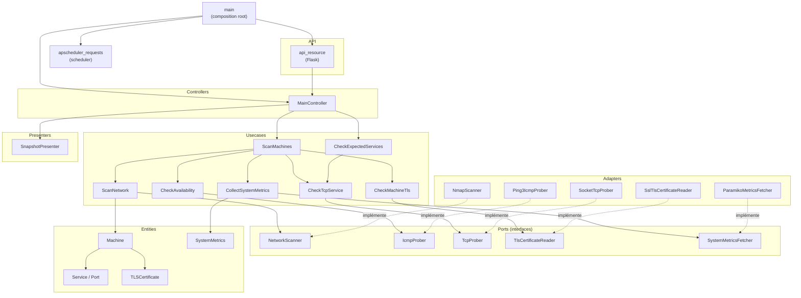

# Architecture simplifiée

```mermaid
flowchart TD
    main["main<br/>(composition root)"]
    sched["apscheduler_requests<br/>(scheduler)"]

    subgraph API
        api["api_resource<br/>(Flask)"]
    end

    subgraph Controllers
        ctrl["MainController"]
    end

    subgraph Usecases
        scanM["ScanMachines"]
        expected["CheckExpectedServices"]
        scanN["ScanNetwork"]
        avail["CheckAvailability"]
        tcp["CheckTcpService"]
        tls["CheckMachineTls"]
        metrics["CollectSystemMetrics"]
    end

    subgraph Ports["Ports (interfaces)"]
        pScan["NetworkScanner"]
        pIcmp["IcmpProber"]
        pTcp["TcpProber"]
        pTls["TlsCertificateReader"]
        pSsh["SystemMetricsFetcher"]
    end

    subgraph Adapters
        nmap["NmapScanner"]
        ping["Ping3IcmpProber"]
        sock["SocketTcpProber"]
        ssl["SslTlsCertificateReader"]
        para["ParamikoMetricsFetcher"]
    end

    subgraph Entities
        machine["Machine"]
        svc["Service / Port"]
        cert["TLSCertificate"]
        sys["SystemMetrics"]
    end

    subgraph Presenters
        snap["SnapshotPresenter"]
    end

    main --> api
    main --> sched
    main --> ctrl
    api --> ctrl
    ctrl --> scanM
    ctrl --> expected
    ctrl --> snap

    scanM --> scanN
    scanM --> avail
    scanM --> tcp
    scanM --> tls
    scanM --> metrics
    expected --> tcp

    scanN --> pScan
    avail --> pIcmp
    tcp --> pTcp
    tls --> pTls
    metrics --> pSsh

    nmap -.implémente.-> pScan
    ping -.implémente.-> pIcmp
    sock -.implémente.-> pTcp
    ssl -.implémente.-> pTls
    para -.implémente.-> pSsh

    scanN --> machine
    machine --> svc
    machine --> cert
    metrics --> sys
```